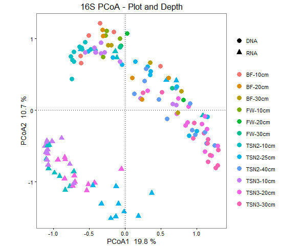
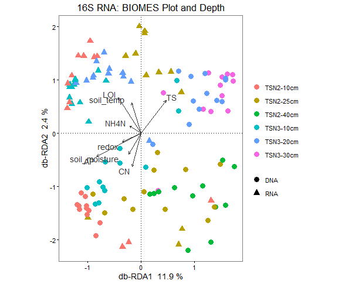
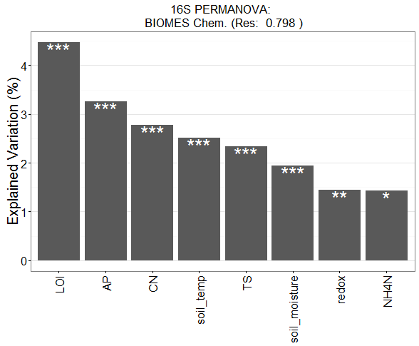

### Plotting VEGAN multivariate ordinations with ggplot
D. Levy-Booth 04/12/2016

### Suite of functions to plot four major multivariate analysis techniques. 

More information on using the "capscape" and "adonis" functions for 
multivariate analysis by Jari Oksanen: 
CAPSCALE: http://cc.oulu.fi/~jarioksa/softhelp/vegan/html/capscale.html
ADONIS: http://cc.oulu.fi/~jarioksa/softhelp/vegan/html/adonis.html

1. PCoA - Multidimentional Scaling of a vegan "capscale" object.
Unconstrained multivariate ordination of dissimilarity matricies
Capscale notation:
pcoa <- capscale(otu_table ~ 1, dist="bray")
pcoa.plot <- plot_pcoa(pcoa, metadata$color, metadata$shape, "Plot Title")

2. db-RDA - distance-based Redundancy Analysis (vegan).
Constrained multivariate ordination with arrows indicating regressor loadings
rda <- capscale(otu_table ~ ., continuous_metadata, dist="bray")
rda.plot <- plot_rda(rda, metadata$color, metadata$shape, "Plot Title")

3. CAP - Constrained Analysis of Principal Coordinates (vegan). 
Constrained ordination of catagorical variables
cap <- capscale(otu_table ~ ., catagorical_metadata, dist="bray")
cap.plot <- plot_cap(cap, metadata$color, metadata$shape, "Plot Title")

4. PERMANOVA - plot barplot of adonis function PERMANOVA(vegan).
Permutational, non-parametric multivariate analysis of variance
Statistically test influence of catagoical and continuous variables on dissimilarity matricies
adonis <- adonis(otu_table ~ ., metadata, dist="bray")
adonis.plot <- adonis_plot(adonis, "Plot Title")

Note that color and shape vectors can be "NULL" 

### Plot Examples: 

PCOA Example

Distance-based RDA Example

PERMANOVA (adonis) Barplot Example
